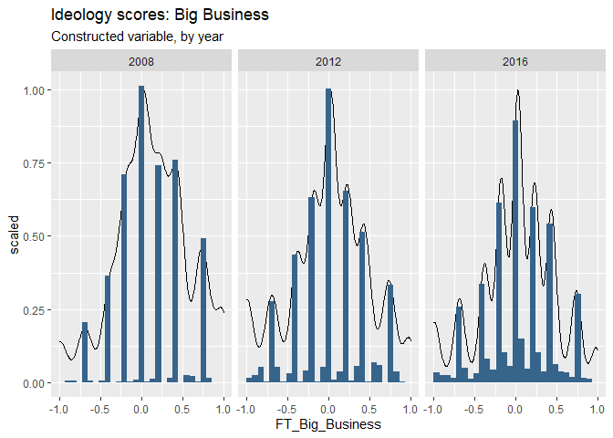
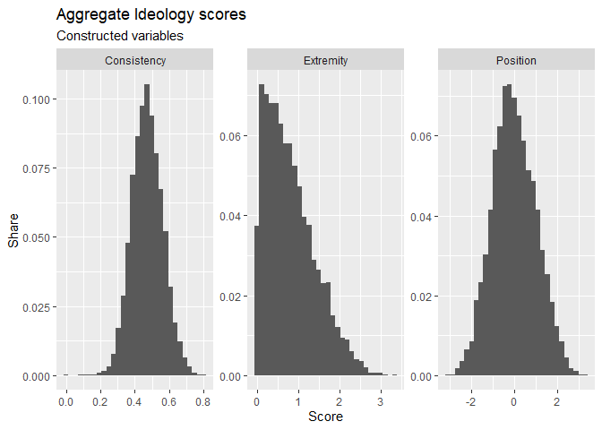
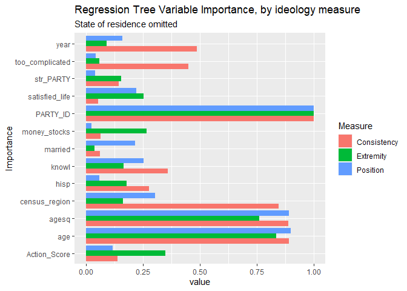
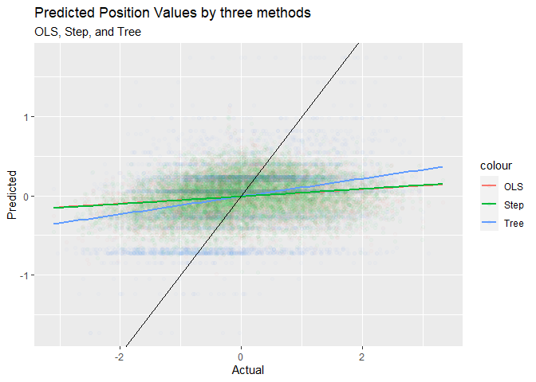
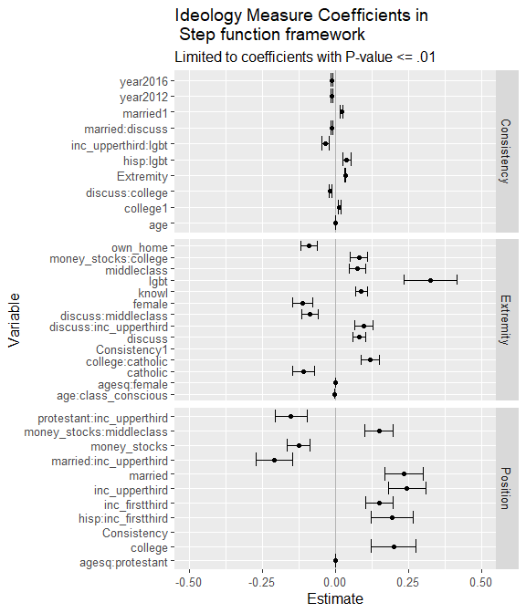

Paper
================
Colin Wick
5/7/2021

OUTLINE

LIMITATIONS OF THE DATA

The ANES is a gold-standard representative sample of the American
electorate, but it faces limitations for the scope of this study.
Namely, measuring actual *radical* sentiment must be inferred based on
self-reported actions and attitudes, meaning some voters will be
included or excluded from the classification based on the scope of
questions which may not capture their underlying attitude.

The ANES contains about 1800 variables, so a pruning and variable
classification process has to take place before any analysis can even be
done. Ultimately, there is a degree to which variable selection is
*arbitrary*. Working with public opinion data requires a degree of
judgement with respect to variable selection and engineering. The ANES
contains 1800 variables which overlap on some matters and contain
redundancies. Such a large pool of variables makes variable construction
a combinatorically unfeasable.

INTRODUCTION

Identity and political ideology are usually examined in a linear and
additive analytic structure. In polling, crosstabs are broken out by
age, race, and education as discrete variables for example. In Napier &
Jost (2009), a model is put together which stratifies outcome variables
based on a matrix of correlations between qualities, which accounts for
the significant heterogeneity and interaction between identity
variables.

In this paper I present two basic models for incorporating
highly-interacted models of public opinion using the ANES time-series
dataset by building an aggregate ideology variable from 35 discrete
attitudes and attempt to build predictive models around this ideology
structure to show the potential for increased power by allowing for more
freedom in variable interaction.

The general setup of the model will operate using a few rough cuts for
simplicity and analytic viability. To define terms: 1. Voter
demographics (DEMO) - components of a voter’s identity which are “fixed”
in the sense that they are reasonably exogenous to political
perspective. Attitudes might plausibly flow from these characteristics,
but politics would not reasonably influence these attributes. 2. Voter
inputs (INPUT) - somewhat exogenous events or characteristics which may
influence a voter’s attitude, like being contacted by a campaign, job
status (union, laid off, industry, etc), urban/rural residence, or any
sort of nudges which a voter may encounter. 3. Politicization (POL) -
Characteristics which are endogenous to a degree. Events known to have a
radicalizing effect, political knowledge, other variables of interest
along similar lines.

(Note: Due to computational complexity and data availability, this list
was reduced significantly but in a more formal research setting it could
be expanded, imputed, or accomodated)

The theoretical basis of the model is that there are characteristics of
people’s demographic or exogenous experience which influence their
relative radicalism in the political system. Political science and
sociological literature explores material and social condition as a
generator of political opinion.

ESTIMATE OF IDEOLOGICAL VARIABLE

Ideology itself is a slippery measurement, since political scientists
and pollsters cannot simply ask “are you ideological?” to a respondent
and reliably get a usable response. An alternative is to estimate a a
rough composite of ANES feelings thermometer and survey questions about
non-voting civic behavior, like protesting, discussion, and activism.
Variables explicitly addressing attitudes for particular candidates and
positions were omitted. Instead, this study focused on questions within
general public opinion at the time and voter characteristics.

The general principle of ideological positioning follows Tomz and Van
Houweling (2008) which uses self-reported stances on issues as a
baseline. There is an obvious issue with taking self-reported
positioning as the “true” population-wide position, but we can disregard
this issue for two reasons. First, we can rest on an assumption that a
voter’s error in estimating their position is, to some degree, randomly
distributed. For any given voter, they may estimate themselves to be
particularly liberal or moderate on an issue and report as such, but
this will be relative to their network and experiences (Sinclair, 2012).
We can assume some portion of variance in the difference between
reported and “true” positioning. Second, this report focuses on
self-conscious ideology, so a particularly liberal person in a
conservative region or network ought to be picked up as “liberal” even
if their “true” postion would be considered moderate by someone on the
left.

There is a rough measure of ideology built-in to the ANES with the “left
right self-placement” variable, which provides a baseline estimate of a
voter’s self-conscious ideology. I scale each variable against its total
scale, since some are on 100-point, others 7-point, or even 3-point
scales by subtracting then dividing by the midpoint. For this measure,
variables which would rank as “high” for liberal ideology are multiplied
by -1 to put all left opinions as less than 0 and all right opinions as
greater than 0.

$V\_{j,i} \\in \[-1,1\] = \\frac{x\_i -s}{s} \\cdot -1^{I(lib)}$

<!-- -->

The visual above shows a histogram of ideological attitude towards “Big
Business” for three ANES years.

For strong ideology, the Feelings Thermometer and Political Attitude
measures are centered on a \[-1,1\] scale from left to right and summary
statistics are taken. The average determines ideological position
aggregated across issues, and standard deviation of this measure
indicates ideological coherence of these positions. Low standard
deviation respondents would correspond to those with more coherent
ideological structure.

Each of these scores is summed up to an ideology score, where respondent
*i* with consistently similar ideological positions on an issue would
end up with relatively extreme positions, while those with moderate
positions or cross-cutting positions end up on the tails of the
distribution.

$Ideo\_i = \\sum\_1^{j} V\_{j,i}$

I then normalize this measure to provide some sense of “unit”. Those
with a score of 0 would be considered the average voter, swing voter, or
politically unsophisticated. A score greater than 1 would represent the
upper 1/3 of the population of right-wing ideological consistency and
less than -1 liberal by the same definition. This provides a workable,
relatively continuous variable which can be used both for classification
(i.e. “The 20% most ideological voters”) and as an measure
(i.e. “Participation in X is associated with 10% higher ideological
consistency”).

Ideological extremity is the absolute value of this measurement. This
groups all those with any extreme ideologies against the same scale.
Creating this variable helps distill potential variables out which may
“equalize” in their predictive value if they are consistently present
among those on either side of the ideological spectrum.

*E**x**t**i* = *a**b**s*(*I**d**e**o**i*)

Finally, ideological consistency is a measure of the average distance
(standard deviation) from the aggregate ideology score and each belief
held by a voter. Those with a low score will have responded with roughly
the same values for each ideology question, those with a large
“consistency” score will be less reliable.

$Cons\_i = \\sqrt{ \\sum(V\_{i,j} - \\bar V\_i)^2}$

This creates the following distributions in the data.

<!-- -->

CAUSALITY VERSUS PREDICTIVE VALUE

A key issue in this dataset, and with data scientific methods in
general, is rendering a causal relationship. The data used in this study
is unlinked over time, which already presents issues with causal
inference.

Rather, this study focuses on unearthing potentially valuable
interaction terms.

As a baseline for model effectiveness, I run a standard linear
regression on the three parameters of interest. This first set of
regressions linearly and additively regresses each ideology component on
a variety of demographic and attitude variables.

    ## 
    ## Regression Results
    ## =========================================================================================
    ##                                                    Dependent variable:                   
    ##                                 ---------------------------------------------------------
    ##                                     Position          Extremity          Consistency     
    ##                                        (1)               (2)                 (3)         
    ## -----------------------------------------------------------------------------------------
    ## age                              -0.004 (0.004)    -0.001 (0.002)     0.001*** (0.0004)  
    ## agesq                           0.00004 (0.00004) 0.00000 (0.00002) -0.00001*** (0.00000)
    ## hisp                            -0.110*** (0.039)   0.009 (0.023)      -0.002 (0.003)    
    ## own_home                         -0.013 (0.029)   -0.037** (0.017)     -0.003 (0.003)    
    ## married                         0.091*** (0.026)    0.005 (0.015)      0.005** (0.002)   
    ## class_conscious                  -0.004 (0.026)    -0.027* (0.015)     -0.002 (0.002)    
    ## discuss                           0.012 (0.029)   0.079*** (0.017)     -0.002 (0.003)    
    ## money_stocks                     -0.020 (0.028)     0.001 (0.016)      -0.003 (0.002)    
    ## college                          0.048* (0.025)     0.012 (0.015)       0.003 (0.002)    
    ## black                             0.034 (0.039)    -0.001 (0.022)      0.0003 (0.003)    
    ## female                           -0.022 (0.023)    -0.017 (0.014)      -0.003 (0.002)    
    ## protestant                        0.036 (0.040)     0.014 (0.023)      -0.004 (0.004)    
    ## catholic                         0.088** (0.043)    0.006 (0.025)      -0.002 (0.004)    
    ## inc_firstthird                  0.081*** (0.030)   -0.009 (0.017)       0.001 (0.003)    
    ## inc_upperthird                    0.008 (0.031)    -0.032* (0.018)      0.003 (0.003)    
    ## lgbt                             -0.067 (0.065)     0.014 (0.037)     -0.014** (0.006)   
    ## middleclass                       0.011 (0.026)    -0.008 (0.015)       0.002 (0.002)    
    ## knowl                             0.014 (0.025)   0.054*** (0.015)    -0.005** (0.002)   
    ## trust_others                     0.050* (0.025)    0.029** (0.015)     -0.003 (0.002)    
    ## Consistency                     -2.111*** (0.128) 1.486*** (0.074)                       
    ## Extremity                                                             0.034*** (0.002)   
    ## satisfied_life                   -0.050 (0.032)    -0.007 (0.019)      -0.002 (0.003)    
    ## understand_issues                -0.005 (0.025)    -0.028* (0.014)     0.0004 (0.002)    
    ## too_complicated                  0.00004 (0.026)    0.012 (0.015)      0.005** (0.002)   
    ## tried_influence                   0.021 (0.024)     0.018 (0.014)      -0.003 (0.002)    
    ## Action_Score                     -0.016 (0.013)    -0.010 (0.007)      -0.001 (0.001)    
    ## census_region2                    0.033 (0.037)     0.027 (0.022)       0.001 (0.003)    
    ## census_region3                   -0.004 (0.034)    0.0004 (0.020)      0.006** (0.003)   
    ## census_region4                    0.038 (0.037)     0.018 (0.021)       0.001 (0.003)    
    ## year2012                          0.028 (0.034)    -0.010 (0.020)     -0.010*** (0.003)  
    ## year2016                          0.019 (0.035)    0.035* (0.020)     -0.011*** (0.003)  
    ## str_PARTY                         0.031 (0.045)    -0.023 (0.026)       0.006 (0.004)    
    ## PARTY_ID2                        -0.016 (0.039)    -0.014 (0.023)      -0.003 (0.003)    
    ## PARTY_ID3                         0.020 (0.049)     0.013 (0.028)       0.004 (0.004)    
    ## PARTY_ID4                         0.063 (0.050)    -0.007 (0.029)       0.002 (0.004)    
    ## PARTY_ID5                                                                                
    ## PARTY_ID6                        0.105** (0.043)   0.055** (0.025)    -0.008** (0.004)   
    ## PARTY_ID7                         0.026 (0.041)     0.032 (0.024)      -0.003 (0.004)    
    ## Constant                        1.142*** (0.205)    0.168 (0.118)     0.439*** (0.017)   
    ## -----------------------------------------------------------------------------------------
    ## Observations                          7,662             7,662               7,662        
    ## R2                                    0.051             0.072               0.074        
    ## Adjusted R2                           0.040             0.061               0.063        
    ## Residual Std. Error (df = 7575)       0.982             0.568               0.086        
    ## F Statistic (df = 86; 7575)         4.741***          6.828***            7.018***       
    ## =========================================================================================
    ## Note:                                                         *p<0.1; **p<0.05; ***p<0.01

These models are technically useable (significant F-statistic), they
suffer from extremely low *R*2 values. Though this model is
barely useful, key trends and common knowledge are already visible,
providing plenty of room for improvement by incorporating machine
learning techniques.

Political knowledge is calculated as a single indicator variable if the
respondent correctly answered which party was in the majority in the
house, demonstrating a baseline understanding of current political
conditions in the United States. About 60% of ANES respondents correctly
answered this question, so it is a reasonably good cutoff question for
“knowledge” within the purpose of this paper.

PARTY\_ID is a question indicating a respondent’s partisan
identification and strength of identification, with 4 being an
independent. Relatively strong Republicans (PARTY\_ID6) indicate lower
ideological consistency but higher levels of extremity than their
corresponding strong Democratic partisans (PARTY\_ID2).

#### Regression Tree

The OLS regression above is useful in providing a sense of estimate
magnitude and significance in a diagnostic sense, but abandoning the
need for specific estimators may yield stronger predictive value from
these variables. A regression tree does not provide nice coefficients,
but inherently allows for complex interactions between all variables in
order to achieve the best predictive performance.

It is immediately obvious that introducing a tree model increases the
predictive capacity of this model dramatically. However, this should be
taken with a grain of salt, since the premise of the model is to explode
the number of terminal nodes, and thus predictive accuracy. I pruned
these trees at the .0015 level. The traditional “rule of thumb” measure
yielded 0 splits, meaning the “best” tree by minimizing error was
essentially guessing randomly.

<table class=" lightable-minimal" style="font-family: &quot;Trebuchet MS&quot;, verdana, sans-serif; margin-left: auto; margin-right: auto;">
<thead>
<tr>
<th style="text-align:left;">
</th>
<th style="text-align:right;">
Position
</th>
<th style="text-align:right;">
Extremity
</th>
<th style="text-align:right;">
Consistency
</th>
</tr>
</thead>
<tbody>
<tr>
<td style="text-align:left;">
OLS
</td>
<td style="text-align:right;">
0.0510756
</td>
<td style="text-align:right;">
0.0719417
</td>
<td style="text-align:right;">
0.0738007
</td>
</tr>
<tr>
<td style="text-align:left;">
Tree
</td>
<td style="text-align:right;">
0.0802804
</td>
<td style="text-align:right;">
0.1106471
</td>
<td style="text-align:right;">
0.0821725
</td>
</tr>
<tr>
<td style="text-align:left;">
Step
</td>
<td style="text-align:right;">
NA
</td>
<td style="text-align:right;">
NA
</td>
<td style="text-align:right;">
NA
</td>
</tr>
</tbody>
</table>

By imposing \~20 splits onto the tree, the *R*2 of the tree
improves dramatically, and we can pull variable importance plots from
the model.

<!-- -->

These plots do not communicate any directionality, rather the importance
in generating “splits” in the tree. To put another way, when predicting
the ideology of a given respondent, higher importance values indicate
that splitting on that variable will yield a better prediction.

#### Step Regression

As a final model, splitting the difference between these two, is a
stepped linear regression. This process runs dozens or hundreds of
regressions, adding and subtracting variables & interactions to achieve
the best fit. This process will not lead to a clean OLS model as seen in
political science or economics literature, but can capture the “messy”
identity-based interactions a simple additive model fails to capture.

<!-- -->

<table class=" lightable-minimal" style="font-family: &quot;Trebuchet MS&quot;, verdana, sans-serif; margin-left: auto; margin-right: auto;">
<thead>
<tr>
<th style="text-align:left;">
</th>
<th style="text-align:right;">
Position
</th>
<th style="text-align:right;">
Extremity
</th>
<th style="text-align:right;">
Consistency
</th>
</tr>
</thead>
<tbody>
<tr>
<td style="text-align:left;">
OLS
</td>
<td style="text-align:right;">
0.0510756
</td>
<td style="text-align:right;">
0.0719417
</td>
<td style="text-align:right;">
0.0738007
</td>
</tr>
<tr>
<td style="text-align:left;">
Tree
</td>
<td style="text-align:right;">
0.0802804
</td>
<td style="text-align:right;">
0.1106471
</td>
<td style="text-align:right;">
0.0821725
</td>
</tr>
<tr>
<td style="text-align:left;">
Step
</td>
<td style="text-align:right;">
0.0536175
</td>
<td style="text-align:right;">
0.0761280
</td>
<td style="text-align:right;">
0.0856129
</td>
</tr>
</tbody>
</table>

The step regression splits the difference between the tree model and the
OLS model in terms of predictability and is less of a “black box” for
interpreting outcomes. The downside is reporting coefficients, since it
generates potentially hundreds of interaction terms. For reporting, I
omit all non-significant variables below the .01 level.

<!-- -->

Introducing an algorithmically-selected set of interactions yields both
a better model fit and new insight into ideological position. In some
cases, the initial significance of a variable disappeared when
interacted with one of the others, like hispanic identity in all three
models.

Due to resource constraints, only one degree of interaction was
available (i.e. all variables only interacted once). The step regression
method could be applied to n-degrees with enough computing power and
observations to make the model valid.

Finally, comparing *R*2 across each of these models, we see
the step regression essentially splits the difference in terms of model
fit. The trade-off is strict econometric rigor at the benefit of
uncovering identity interactions driving ideological position and
structure in the electorate.

#### Discussion

This paper shows that ideology is deeply related not only to
macro-identites like race, age, and religion, but interactions between
those identities into more specific configurations has a real effect on
ideological position, extremeness, and consistency. I also present a
configuration of ideological structure which relies on current
literautre but provides a basis for deeper analysis. By analyzing
ideological consistency and position in this manner, direct estimates of
position can be estimated against shocks.

Developing a highly-interacted methodology in demographic analysis of
politics is critical as identities fractally expand under current
political and social circumstances. This presents a major drawback to
survey methods which rely on crosstabs as a basis of analysis of this
depth. Application of this method to such surveys may uncover insights
into novel opinion formations in the population.

Though not causal, a key use of the tree & step methods can provide a
way to impute data into “Don’t Knows” in otherwise gold-standard surveys
to provide a basis for building more robust datasets. In this analysis,
a significant number of variables had to be dropped due to a single NA,
which breaks regression and tree algorithms. For example, if one set of
observations has NA’s in one variable, and another set has NA’s in
another variable, *all* observations with either variable must be
dropped in regression analysis. Or, both of those variables must be
dropped. In a situation where NA’s can be assumed to be random, a
methodology like this would provide a way to impute those observations
to build out richer data.

#### Looking forward

A methodology like this requires a longer timeline of thought and
participation, but I have demonstrated a basis for a deeper conversation
for ideological structure and its roots in identity. Whether, or how,
these interactions “cause” ideology is not clear, especially in the case
of consistency

The most glaring issue with this setup is the structure of the ANES
data. First it is not a panel dataset nor is it balanced, so these
estimates may not be valid on that basis alone. There is no causal claim
that can be made from this per se, but introducing a linked-panel
element in a broader study could yield interesting results in the field
of studying ideology and ideology formation. Similarly, the presence of
Refuse/Don’t Know’s complicates any survey study, since they cannot
necessarily be considered randomly distributed and computed away.

Future avenues of research include creating a node-edge graph of a wider
array of ideological components, tracking centrality among partisans and
non-partisans, extremists and non-extremists. Measures of “closeness”
can be translated into an edge list and therefore a graph of ideology
with key, or central, beliefs in the center.
